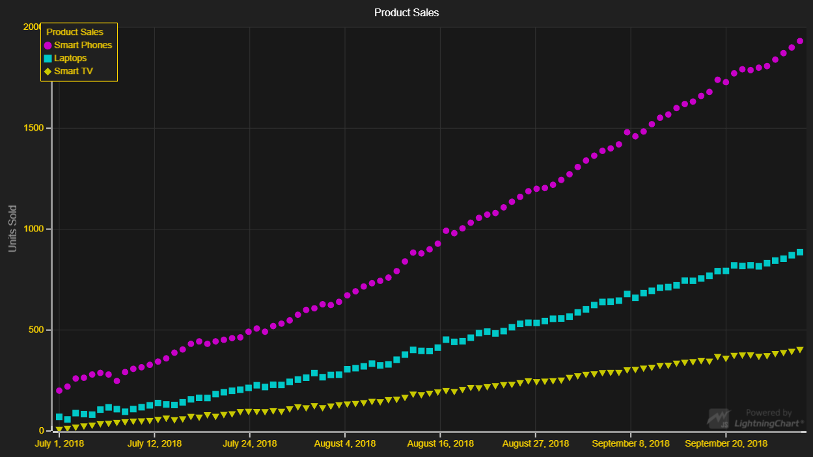

# Scatter Chart



This demo application belongs to the set of examples for LightningChart JS, data visualization library for JavaScript.

LightningChart JS is entirely GPU accelerated and performance optimized charting library for presenting massive amounts of data. It offers an easy way of creating sophisticated and interactive charts and adding them to your website or web application.

The demo can be used as an example or a seed project. Local execution requires the following steps:

- Make sure that relevant version of [Node.js](https://nodejs.org/en/download/) is installed
- Open the project folder in a terminal:

        npm install              # fetches dependencies
        npm start                # builds an application and starts the development server

- The application is available at *http://localhost:8080* in your browser, webpack-dev-server provides hot reload functionality.


## Description

*Also known as a Scatter Graph, Scatter Series, Point Graph, Scatter diagram or Scattergram*

This example shows a simple Point Graph with points drawn using PointSeries for a visual representation of the data points 'markers'. The point graph is a type of chart or mathematical diagram drawn on a Cartesian coordinate system and represents the relationship between two variables.

This type of series does not contain the visual representation of lines for the connection of data points but only data 'markers'.

The chart can be created with few simple lines of code:

```javascript
// Add a scatter series with markers using default X and Y axes.
const pointSeries = chart.addPointSeries()
```

The PointSeries API allows configuring the visual representation of data markers.

- PointShape: *enum*

    | PointShape    | Description                              |
    | :-----------: | :--------------------------------------: |
    | Rectangle     | The series with rectangle-shaped points  |
    | Triangle      | The series with triangle-shaped points.  |
    | Square        | The series with square-shaped points.    |

    PointShape must be specified upon creation of Series!

    ```javascript
    // Add a scatter series with markers using default X and Y axes. Select Circle PointShape.
    const pointSeries = chart.addPointSeries( { pointShape: PointShape.Circle } )
    ```

- PointSize: *number*
    ```javascript
    pointSeries
        .setPointSize(5.0)
    ```

- FillStyle
    Scatter Series with markers provides an ability to specify a fill style of data markers as well as individual point fill style (explained further).

    ```javascript
    pointSeries
        .setPointFillStyle(fillStyleObject)
    ```

- IndividualPointFill: *FillStyle*

    The style indicates individual per point coloring. The style enables the usage of individual fill taken from the input. 
    The series can accept points in format `{ x: number, y: number, color: Color }`
    If the color is not provided during the input of data points ( e.g. in format `{ x: number, y: number }` ), the configurable fallback color is used.
    ```javascript
    // Create the instance of IndividualPointFill fill style.
    const individualStyle = new IndividualPointFill()
    // Set red color as a fallback color
    individualStyle.setFallbackColor( ColorRGBA( 255, 0, 0 ) )
    ```

As it was mentioned before, the series accepts points in format `{ x: number, y: number: color: Color }` with specified IndividualPointFill to enable individual point coloring or `{ x: number, y: number }` for other fill styles. Any number of points can be added with a single call similarly to line series with point markers.

- Dataset without colors. If IndividualPointFill is specified, the fallback color is used. Otherwise, the specified fill style is used.

    ```javascript
    // Dataset of Vec2 data points without color.
    pointSeries
        .add([
            { x: 5, y: 10 },
            { x: 7.5, y: 20 },
            { x: 10, y: 30 }
        ])
    ```
- Dataset with individual colors. If IndividualPointFill is specified, the color from data point or fallback color is used. Otherwise, the specified fill style is used.

    ```javascript
    // Dataset of Vec2Color data points with individual color.
    pointSeries
        .add([
            // use red color if IndividualPointFill is specified
            { x: 2.5, y: 0, color: ColorRGBA( 255, 0, 0 ) },
            // use fallback color if IndividualPointFill is specified
            { x: 5, y: 10 },
            // use green color if IndividualPointFill is specified
            { x: 7.5, y: 20, color: ColorRGBA( 0, 255, 0 ) },
            // use blue color if IndividualPointFill is specified
            { x: 10, y: 30, color: ColorRGBA( 0, 0, 255 ) },
        ])
    ```


## API Links

* XY cartesian chart: [ChartXY]
* RGBA color factory: [ColorRGBA]
* Point series: [PointSeries]
* Point Shape options: [PointShape]
* Random trace data generator: [TraceGenerator]


## Support

If you notice an error in the example code, please open an issue on [GitHub][0] repository of the entire example.

Official [API documentation][1] can be found on [Arction][2] website.

If the docs and other materials do not solve your problem as well as implementation help is needed, ask on [StackOverflow][3] (tagged lightningchart).

If you think you found a bug in the LightningChart JavaScript library, please contact support@arction.com.

Direct developer email support can be purchased through a [Support Plan][4] or by contacting sales@arction.com.

[0]: https://github.com/Arction/
[1]: https://www.arction.com/lightningchart-js-api-documentation/
[2]: https://www.arction.com
[3]: https://stackoverflow.com/questions/tagged/lightningchart
[4]: https://www.arction.com/support-services/

© Arction Ltd 2009-2020. All rights reserved.


[ChartXY]: https://www.arction.com/lightningchart-js-api-documentation/v1.2.0/classes/chartxy.html
[ColorRGBA]: https://www.arction.com/lightningchart-js-api-documentation/v1.2.0/globals.html#colorrgba
[PointSeries]: https://www.arction.com/lightningchart-js-api-documentation/v1.2.0/classes/pointseries.html
[PointShape]: https://www.arction.com/lightningchart-js-api-documentation/v1.2.0/enums/pointshape.html
[TraceGenerator]: https://arction.github.io/xydata/classes/tracegenerator.html

